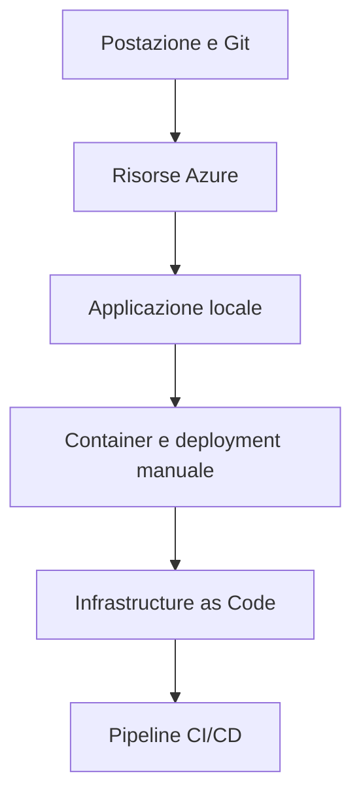
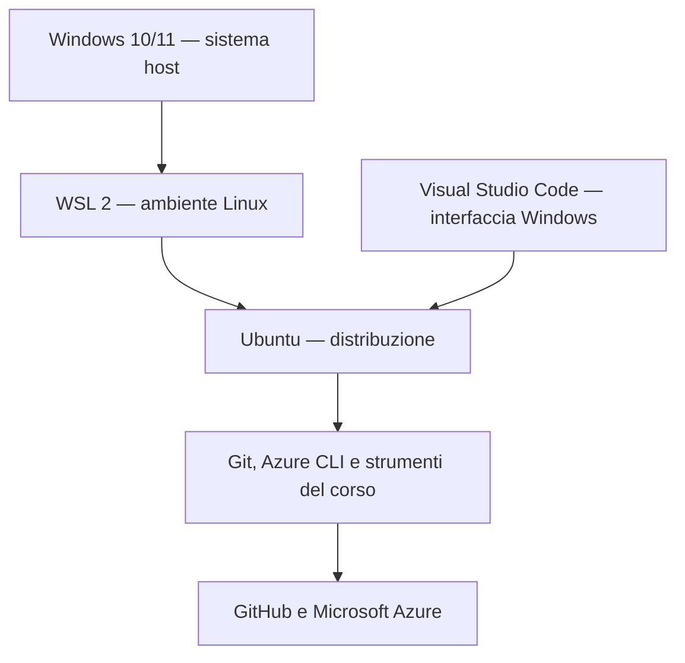
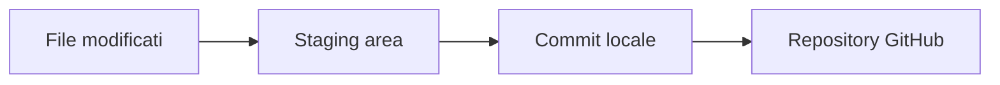

# Concetti — Il percorso di 120 ore e l'ambiente di lavoro

## 1. Panoramica completa del percorso di 120 ore

Questa parte occupa **120 minuti effettivi** e presenta l'intero percorso prima di iniziare la configurazione della postazione. Lo scopo è comprendere fin dall'inizio perché vengono introdotti determinati strumenti, quale relazione esiste tra le unità e quale risultato professionale costruisce ogni laboratorio.

| Fase | Durata | Contenuto |
|---|---:|---|
| Orientamento | 15 min | finalità, destinatari e risultati professionali |
| Architettura del percorso | 25 min | quattro moduli e dipendenze tra le competenze |
| Caso applicativo trasversale | 25 min | evoluzione del Catalogo prodotti dall'esecuzione locale alla delivery automatizzata |
| Strumenti | 25 min | ruolo dei principali applicativi e servizi utilizzati |
| Metodo ed evidenze | 20 min | organizzazione dei materiali, laboratori, repository e risultati verificabili |
| Consolidamento | 10 min | lettura di scenari e domande di controllo |
| **Totale** | **120 min** | **panoramica dell'intero percorso** |

### Finalità professionale

Il percorso sviluppa competenze iniziali per operare su Microsoft Azure e comprendere un processo DevOps completo. Non è un corso di programmazione applicativa, non è un corso esteso di amministrazione Linux e non è presentato come preparazione alla certificazione. Il codice e gli script vengono utilizzati per imparare a configurare ambienti, distribuire applicazioni e automatizzare attività ripetibili.

Al termine delle 120 ore il partecipante dovrà essere in grado di:

- riconoscere i principali modelli cloud e la struttura organizzativa di Azure;
- creare, interrogare, modificare e rimuovere risorse Azure controllando accessi e costi;
- utilizzare Git e GitHub per conservare codice, configurazioni ed evidenze;
- eseguire e diagnosticare un'applicazione locale;
- costruire ed eseguire container con Docker;
- pubblicare immagini in Azure Container Registry e distribuirle in Azure Container Apps;
- leggere e modificare template Bicep;
- gestire il ciclo di vita dell'infrastruttura con Terraform;
- comprendere e realizzare pipeline CI/CD con Azure Pipelines;
- distinguere una modifica al codice, una modifica all'infrastruttura e una modifica al processo di delivery;
- documentare controlli, errori, costi e cleanup in modo riproducibile.

Queste capacità ricorrono in ruoli junior cloud, sistemistici e DevOps. Il livello iniziale non richiede di amministrare da soli un ambiente di produzione; richiede però di comprendere le operazioni eseguite, verificare l'esito e riconoscere quando una configurazione non corrisponde ai requisiti.

### I quattro moduli

| Modulo | UD | Competenze costruite | Risultato osservabile |
|---|---|---|---|
| Cloud e Microsoft Azure Fundamentals | UD01–UD03 | linguaggio del cloud, struttura Azure, identità, autorizzazioni, governance e costi | ambiente di lavoro pronto e prime operazioni controllate su Azure |
| Amministrazione operativa di Microsoft Azure | UD04–UD07 | storage, reti, compute, CLI, monitoraggio essenziale e troubleshooting | risorse configurate, interrogate e ripulite con procedure verificabili |
| DevOps, Git e container | UD08–UD11 | collaborazione Git, applicazione locale, Azure DevOps, Docker, ACR e Container Apps | applicazione containerizzata e distribuita manualmente |
| Automazione, Infrastructure as Code e CI/CD | UD12–UD15 | Bicep, Terraform, pipeline CI e CD, gestione degli errori e cleanup | infrastruttura e deployment automatizzati |

La suddivisione non crea compartimenti isolati. Git viene introdotto nell'UD01 e riutilizzato in tutte le unità. Azure CLI viene verificato durante il setup, poi diventa uno strumento operativo. Docker compare dopo aver compreso l'applicazione locale. Le pipeline arrivano soltanto dopo che build, push e deployment sono stati eseguiti manualmente.

### La progressione delle dipendenze



La freccia indica una dipendenza didattica. Una pipeline che costruisce un'immagine Docker è comprensibile soltanto se sono già chiari Dockerfile, build context, tag e registry. Un deployment automatizzato con Terraform è comprensibile soltanto se sono già noti resource group, nomi, località e proprietà delle risorse.

Questo criterio evita che YAML, Bicep o Terraform diventino testi da copiare senza comprendere. L'automazione arriva dopo l'operazione manuale e ne conserva gli stessi controlli: input, risultato atteso, verifica, gestione dell'errore e cleanup.

### Il Catalogo prodotti come applicazione trasversale

Il Catalogo prodotti è composto da un frontend e da un backend/API. Il codice applicativo è già predisposto: non è necessario imparare il framework con cui è stato scritto né ricostruire l'applicazione da zero. L'applicazione serve come carico di lavoro stabile sul quale osservare infrastruttura e delivery.

La sua evoluzione nel corso sarà:

1. lettura della struttura e avvio locale;
2. verifica degli endpoint e dei test automatici essenziali;
3. costruzione delle immagini container;
4. esecuzione coordinata di frontend e backend;
5. pubblicazione delle immagini in ACR;
6. deployment manuale in Azure Container Apps;
7. provisioning delle risorse con Infrastructure as Code;
8. build e test automatici nella pipeline CI;
9. pubblicazione e deployment automatici nella pipeline CD;
10. diagnosi di un errore introdotto e ripristino del rilascio.

Usare la stessa applicazione permette di osservare che il codice può restare invariato mentre cambiano ambiente, modalità di distribuzione e livello di automazione. Consente inoltre di confrontare la procedura manuale con quella eseguita dalla pipeline.

### Strumenti e responsabilità

| Strumento o servizio | Funzione nel percorso | Non viene usato per |
|---|---|---|
| Windows 10/11 | sistema host della postazione | sostituire l'ambiente Linux dei laboratori |
| WSL 2 con Ubuntu | shell e ambiente Linux locale | simulare l'intera piattaforma Azure |
| Visual Studio Code | modificare file, usare terminale e Git nel contesto WSL | nascondere i comandi eseguiti |
| Git | versionare localmente file e modifiche | sostituire GitHub o Azure Pipelines |
| GitHub | materiali, codice, repository personali e consegne | eseguire le pipeline Azure DevOps |
| Azure Portal | comprendere risorse, proprietà e relazioni mediante interfaccia grafica | rendere automaticamente ripetibile una procedura |
| Azure CLI | interrogare e modificare Azure con comandi riproducibili | sostituire la comprensione delle risorse |
| Docker | costruire ed eseguire immagini e container | orchestrare cluster Kubernetes |
| Azure Container Registry | conservare immagini container versionate | eseguire l'applicazione |
| Azure Container Apps | eseguire l'applicazione containerizzata in Azure | sostituire il registry |
| Bicep | introdurre l'IaC nativa di Azure | diventare lo strumento IaC principale del corso |
| Terraform | descrivere e gestire il ciclo di vita dell'infrastruttura | distribuire codice senza una configurazione definita |
| Azure DevOps | ospitare Azure Pipelines e gestire gli agent | duplicare repository e consegne già presenti su GitHub |

Non vengono introdotti Kubernetes, Jenkins, SonarQube, Ansible, Prometheus o Grafana. Limitare il numero di strumenti consente di dedicare tempo alla comprensione della catena operativa completa.

### Organizzazione dei repository

Il percorso usa GitHub come unico sistema remoto per materiali, codice e consegne:

| Repository | Contenuto | Operazioni principali |
|---|---|---|
| Privato del corso | materiali completi e soluzioni | preparazione e pubblicazione selettiva |
| Pubblico del corso | materiali progressivamente disponibili | `clone` e `pull` |
| Personale pubblico `azure-devops-lab` | laboratori, codice, infrastruttura ed evidenze | modifica, `commit`, `push`, collaborazione con il docente e collegamento alle pipeline |

Azure Repos non viene utilizzato. Azure Pipelines leggerà direttamente il repository GitHub personale. Questa scelta evita di duplicare lo stesso codice in due repository remoti e mantiene continuo il lavoro iniziato nell'UD01.

Il repository personale è pubblico per rendere osservabili le evidenze professionali. Il docente viene invitato come collaboratore perché nelle attività successive dovrà poter partecipare a revisione e collaborazione: l'invito non serve alla semplice lettura. Il partecipante rimane proprietario del repository e non condivide mai credenziali, token o codici MFA.

### Metodo delle unità didattiche

Ogni unità alterna concetti, dimostrazione, laboratorio guidato, laboratorio autonomo e verifica. I cinque elementi hanno funzioni differenti:

- i concetti definiscono termini, relazioni e criteri decisionali;
- la dimostrazione mostra una sequenza completa e rende visibili gli stati intermedi;
- il laboratorio guidato costruisce il risultato con controlli e diramazioni;
- il laboratorio autonomo cambia dati o introduce un problema da risolvere usando soltanto il materiale disponibile;
- la verifica controlla comprensione, scelta della procedura e capacità operativa.

Le procedure non devono essere memorizzate come sequenze rigide. Ogni operazione viene collegata a uno scopo, a un output atteso e a un controllo. Se uno strumento è già installato e funzionante non viene reinstallato. Se una versione differisce da quella usata nei materiali, si valuta la compatibilità prima di decidere un aggiornamento.

### Evidenze e risultati progressivi

Il repository personale raccoglierà progressivamente:

```text
azure-devops-lab/
├── README.md
├── evidenze/
├── laboratori/
├── app/
├── infra/
│   ├── bicep/
│   └── terraform/
├── Dockerfile
├── docker-compose.yml
└── azure-pipelines.yml
```

Un'evidenza non è una raccolta indiscriminata di schermate. Deve indicare il risultato cercato, l'operazione eseguita, il controllo utilizzato e l'eventuale problema diagnosticato. Non deve contenere password, token, codici temporanei, chiavi, stringhe di connessione o identificativi non necessari.

La progressione permette di osservare competenze concrete: il primo commit, uno script Azure CLI, una rete configurata, un'immagine Docker, un piano Terraform e l'esecuzione di una pipeline. Ogni risultato diventa prerequisito o materiale riutilizzabile nelle unità successive.

### Perimetro e aspettative

Le 120 ore permettono di acquisire basi operative e un metodo di lavoro. Non promettono padronanza avanzata di tutti i servizi Azure né esperienza equivalente alla gestione autonoma di un sistema di produzione. Le attività sviluppano però il lessico, i controlli e i workflow necessari per proseguire con esercitazioni più specialistiche o per inserirsi in un gruppo di lavoro con compiti iniziali ben definiti.

La qualità del risultato non dipende dal numero di comandi eseguiti. Dipende dalla capacità di spiegare dove è stata eseguita un'operazione, quale stato ha modificato, come è stato verificato l'esito e come si può ripristinare o ripulire l'ambiente.

⏱

### Domande di consolidamento della panoramica

1. Perché il deployment manuale precede la pipeline CD?
2. Quale differenza di responsabilità esiste tra ACR e Azure Container Apps?
3. Perché GitHub rimane il repository remoto anche quando vengono introdotte Azure Pipelines?
4. Quale vantaggio didattico offre l'uso continuativo del Catalogo prodotti?
5. In quale punto del percorso l'infrastruttura diventa descritta come codice?
6. Quali elementi deve contenere un'evidenza tecnica utile?
7. Quali strumenti sono esplicitamente esclusi dal percorso?
8. Perché una versione più recente non determina automaticamente un aggiornamento?

⏱

## 2. Preparare l'ambiente è un'attività tecnica

In un'attività professionale, una procedura può funzionare sul computer sul quale è stata scritta e fallire su un altro sistema. Le cause più comuni non sono necessariamente errori nel codice: possono dipendere da versioni diverse, percorsi differenti, strumenti installati in ambienti diversi, autorizzazioni mancanti o configurazioni non documentate.

Per questo preparare l'ambiente non significa soltanto “installare programmi”. Significa costruire una postazione della quale conosciamo componenti, versioni, posizione dei file e modalità di verifica. La stessa disciplina verrà applicata in seguito alle risorse Azure, ai container, all'Infrastructure as Code e alle pipeline.

Una descrizione tecnica completa deve indicare:

- in quale ambiente è stata eseguita l'operazione;
- quali prerequisiti erano presenti;
- come è stato verificato il risultato;
- quali informazioni servono per riprodurre o diagnosticare il comportamento.

## 3. L'ambiente che useremo



Windows rimane il sistema operativo della postazione. WSL 2 mette a disposizione un kernel Linux e consente di eseguire una distribuzione come Ubuntu senza dover amministrare una macchina virtuale tradizionale. Visual Studio Code viene installato sul lato Windows, ma tramite l'estensione WSL apre cartelle ed esegue terminali e strumenti dentro Ubuntu.

Questa scelta ci avvicina agli ambienti reali nei quali applicazioni, container, agent di pipeline e servizi cloud utilizzano frequentemente strumenti Linux. Allo stesso tempo possiamo continuare a usare il browser e le applicazioni Windows.

### Windows non è Ubuntu

Windows e Ubuntu hanno file system, percorsi, utenti e installazioni distinti. Il comando `git --version` eseguito in PowerShell può quindi mostrare un risultato diverso dallo stesso comando eseguito nel terminale Ubuntu.

Questa non è un'anomalia. Significa che esistono due installazioni in due ambienti differenti. Nel corso useremo principalmente gli strumenti installati dentro Ubuntu, mentre alcune applicazioni grafiche — per esempio Visual Studio Code e successivamente Docker Desktop — saranno applicazioni Windows integrate con WSL.

## 4. WSL, WSL 2 e Ubuntu

WSL è la funzionalità di Windows. WSL 2 è l'architettura che utilizza un kernel Linux reale in una macchina virtuale leggera. Ubuntu è una delle distribuzioni Linux che possono essere eseguite sopra WSL.

Il comando seguente, eseguito in PowerShell, elenca le distribuzioni e mostra se ciascuna usa WSL 1 o WSL 2:

```powershell
wsl --list --verbose
```

La colonna `VERSION` dovrà riportare `2` per la distribuzione usata nel corso. Questo controllo è importante perché Docker Desktop e diversi workflow moderni sono progettati per WSL 2.

`wsl --version` mostra invece la versione del componente WSL e dei suoi elementi. Sono due informazioni diverse:

- `wsl --version` indica la versione del software WSL;
- `wsl --list --verbose` indica se una distribuzione sta usando l'architettura WSL 1 o WSL 2.

Per le attività Docker successive useremo almeno WSL **2.1.5**. Se `wsl --version` non restituisce i dettagli, esegui prima `wsl --status`. Se la distribuzione è funzionante ma il componente è la versione integrata meno recente, salva i lavori aperti, esegui `wsl --update`, arresta WSL con `wsl --shutdown` e ripeti i controlli. L'aggiornamento si considera riuscito soltanto se la distribuzione torna ad avviarsi e `wsl --list --verbose` continua a indicare la versione 2.

### Versione e distribuzione non sono sinonimi

Dentro Ubuntu possiamo eseguire:

```bash
cat /etc/os-release
uname -r
```

Il primo comando descrive la distribuzione e la sua versione; il secondo mostra il kernel in uso. Nel corso sono previsti Ubuntu 22.04 LTS o Ubuntu 24.04 LTS, entrambe supportate dal metodo `apt` documentato da Microsoft per Azure CLI.

## 5. Dove conservare i progetti

Creeremo i progetti nella home Linux:

```text
~/workspace/
```

Il carattere `~` rappresenta la home dell'utente Ubuntu. Un percorso come `/mnt/c/Users/...` punta invece al file system Windows montato dentro WSL.

Entrambe le posizioni sono accessibili, ma non hanno lo stesso comportamento. Conservare il codice nel file system Linux migliora le prestazioni e la gestione degli eventi sui file quando lavoreremo con container e bind mount. Per questo useremo:

```bash
mkdir -p ~/workspace
cd ~/workspace
```

La scelta del percorso non è quindi estetica: prepara il progetto al workflow Docker delle unità successive.

## 6. Il terminale come strumento di verifica

Un'interfaccia grafica mostra spesso lo stato corrente, ma può nascondere dettagli necessari per riprodurre un'operazione. Il terminale consente di eseguire comandi precisi, conservarli nella documentazione e confrontare gli output.

I primi comandi Linux che useremo sono:

| Comando | Effetto |
|---|---|
| `pwd` | mostra la cartella corrente |
| `ls -la` | elenca anche file nascosti e dettagli essenziali |
| `cd percorso` | cambia cartella |
| `mkdir -p percorso` | crea una cartella e gli eventuali livelli mancanti |
| `command --version` | mostra normalmente la versione dello strumento |
| `command --help` | mostra la guida sintetica, quando supportata |
| `clear` | pulisce la visualizzazione del terminale |

La shell distingue maiuscole e minuscole. `README.md` e `readme.md` possono essere file differenti. Questa differenza diventa importante quando un progetto viene eseguito in Linux o in una pipeline anche se è stato modificato inizialmente su Windows.

### Leggere un comando

Consideriamo:

```bash
mkdir -p ~/workspace/azure-devops-lab
```

`mkdir` è il programma richiamato, `-p` è un'opzione e il percorso finale è l'argomento. L'opzione `-p` evita un errore se una parte del percorso esiste già e crea gli eventuali livelli mancanti.

Non memorizzeremo ogni opzione isolatamente. Impareremo a riconoscere la struttura dei comandi e a consultare la guida quando necessario.

## 7. File, cartelle e Markdown

Un file contiene dati; una cartella organizza file e altre cartelle. Il percorso indica dove si trova un elemento. Un percorso assoluto parte dalla radice, per esempio `/home/utente/workspace`; un percorso relativo parte invece dalla cartella corrente, come `docs/nota.md`. `pwd` mostra il punto di partenza e `ls -la` permette di verificare anche i file nascosti, come `.gitignore`.

L'estensione aiuta a riconoscere il formato e lo strumento che normalmente lo elabora. Nei repository useremo spesso `.md` per Markdown, `.sh` per script Bash, `.ps1` per PowerShell, `.yml` o `.yaml` per configurazioni e pipeline. L'estensione non garantisce da sola il contenuto corretto: un file YAML mal formattato resta un file non utilizzabile.

Markdown consente di scrivere documentazione leggibile come testo e renderizzata da GitHub. Le forme essenziali sono:

````markdown
# Titolo
## Sezione

- elemento di elenco
- secondo elemento

`comando breve`

```bash
comando --opzione
```
````

Nel lavoro tecnico un `README.md` descrive scopo, prerequisiti, avvio e verifiche di un progetto. Modificarlo durante il laboratorio non è quindi un esercizio di videoscrittura: introduce la documentazione versionata che accompagnerà codice, infrastruttura e pipeline.

### Come leggere gli script didattici

Gli script presenti nel corso automatizzano controlli che possono essere eseguiti anche manualmente. Prima dell'esecuzione devono essere letti come documentazione tecnica. In PowerShell `#` introduce un commento su una riga e `<# ... #>` racchiude un commento esteso; in Bash ogni riga che inizia con `#`, esclusa la prima riga `#!`, è un commento.

Durante la lettura individua:

- gli input, come parametri o argomenti;
- le variabili che conservano percorsi e risultati;
- le funzioni che raggruppano operazioni riutilizzabili;
- le condizioni `if/else`, che scelgono un ramo in base all'esito di un controllo;
- i cicli, che applicano lo stesso controllo a più elementi;
- le redirezioni, che decidono dove vengono inviati output ed errori;
- il file o il messaggio prodotto come risultato finale.

Un commento spiega l'istruzione ma non ne dimostra il funzionamento. Dopo la lettura occorre ancora confrontare ciò che lo script dichiara con l'output effettivamente generato.

⏱

## 8. Visual Studio Code collegato a WSL

Visual Studio Code deve essere installato in Windows. L'estensione WSL crea e gestisce i componenti necessari dentro Ubuntu. Quando da una cartella Linux eseguiamo:

```bash
code .
```

il punto indica la cartella corrente. Si apre una finestra di VS Code collegata a WSL; nell'angolo inferiore sinistro deve comparire un'indicazione simile a `WSL: Ubuntu`.

In quella finestra:

- i file aperti si trovano nel file system Linux;
- il terminale integrato esegue Bash in Ubuntu;
- Git e Azure CLI vengono cercati nell'ambiente Linux;
- le estensioni che devono eseguire codice possono avere una componente installata dentro WSL.

Aprire la stessa cartella come cartella Windows e come cartella WSL può produrre comportamenti differenti. Prima di diagnosticare un problema verificheremo quindi sempre il contesto mostrato da VS Code.

⏱

## 9. Git e GitHub svolgono lavori diversi

Git è il sistema di versionamento distribuito installato sulla postazione. Registra la storia del progetto in una cartella nascosta `.git`. GitHub è un servizio remoto che ospita repository Git e abilita collaborazione, revisione e integrazioni.

Si può usare Git senza GitHub e si può modificare un file sul sito GitHub senza avere Git installato localmente. Nel nostro workflow li useremo insieme.



`git add` seleziona le modifiche che entreranno nel prossimo commit. `git commit` crea un punto della storia locale. `git push` invia i commit al repository remoto. Queste operazioni non sono equivalenti e possono riuscire o fallire separatamente.

### Stato, selezione e registrazione

Il comando più utile mentre si impara Git è:

```bash
git status
```

Mostra il branch corrente, le modifiche rilevate, i file preparati per il commit e l'eventuale relazione con il repository remoto.

Una sequenza tipica sarà:

```bash
git status
git add evidenze/UD01.md
git status
git commit -m "Completa evidenza UD01"
git push
```

Il secondo `git status` permette di osservare l'effetto di `git add`. In un contesto lavorativo questa verifica riduce il rischio di includere file non voluti o di dimenticare una modifica necessaria.

### Identità dell'autore

Ogni commit contiene nome ed e-mail dell'autore. Git legge normalmente questi valori dalla configurazione dell'utente:

```bash
git config --global user.name
git config --global user.email
```

Se un valore è assente o errato, lo configureremo prima del primo commit. Per tutelare l'indirizzo personale è possibile usare l'indirizzo `noreply` fornito da GitHub, purché sia quello associato al proprio account.

La configurazione dell'autore non è l'autenticazione. Il nome nel commit dichiara chi ha creato la modifica; l'autenticazione dimostra a GitHub che l'account ha il diritto di eseguire il push.

⏱

## 10. Repository del corso e repository personale

Useremo due repository con responsabilità distinte:

| Repository | Contenuto | Operazioni prevalenti |
|---|---|---|
| Pubblico del corso | materiali, file iniziali e aggiornamenti ufficiali | `clone` e `pull` |
| Personale `azure-devops-lab` | esercitazioni, codice ed evidenze del partecipante | modifica, `commit` e `push` |

Il repository pubblico viene usato in sola lettura per ricevere i materiali. Il repository personale dimostra il lavoro svolto e diventerà progressivamente il progetto sul quale agiranno Docker, Terraform e Azure Pipelines.

⏱

## 11. Evidenza tecnica non significa raccolta indiscriminata di screenshot

Un'evidenza utile permette a un'altra persona di capire che cosa è stato realizzato e come è stato verificato. Uno screenshot senza contesto può mostrare un risultato, ma spesso non spiega il comando eseguito, l'ambiente o il criterio di successo.

Preferiremo quindi:

- brevi output testuali ripuliti;
- comandi essenziali;
- una spiegazione sintetica della verifica;
- screenshot soltanto quando l'interfaccia grafica contiene un'informazione non facilmente riportabile in testo.

Non pubblicheremo output completi se contengono informazioni personali o identificativi non necessari. Un token mostrato nel terminale deve essere considerato compromesso e revocato, non semplicemente coperto nello screenshot.

## 12. Installare è una decisione, non il primo passo

Prima di installare uno strumento verificheremo presenza, versione e funzionamento. I possibili esiti sono diversi:

| Risultato | Decisione |
|---|---|
| Lo strumento non esiste | installazione guidata |
| Esiste ed è compatibile | nessuna reinstallazione; test funzionale |
| Esiste ma è troppo vecchio per il laboratorio | aggiornamento controllato |
| Esiste ma non funziona | diagnosi prima di reinstallare |
| È più recente di quella usata nel materiale | test di compatibilità, senza downgrade automatico |

Questa disciplina evita di perdere configurazioni funzionanti e rispecchia il lavoro su server e postazioni aziendali, dove un aggiornamento non pianificato può modificare dipendenze o procedure condivise.

## 13. Versioni e criteri adottati nell'UD01

| Componente | Criterio del corso |
|---|---|
| Windows | versione 64 bit supportata con WSL 2 e virtualizzazione disponibili |
| WSL | WSL 2; componente WSL almeno 2.1.5 in preparazione a Docker |
| Ubuntu | 22.04 LTS o 24.04 LTS |
| Visual Studio Code | versione Stable supportata; installazione Windows, apertura WSL funzionante |
| Git in Ubuntu | almeno 2.23; versione fornita dai repository supportati di Ubuntu |
| Azure CLI | versione rilevata con `az version`; compatibilità verificata mediante login e lettura dell'account |
| Docker | viene soltanto rilevato; installazione e configurazione saranno svolte nella UD dedicata |

Il test funzionale ha più valore del solo numero di versione. Per esempio, la presenza di Visual Studio Code è confermata davvero quando `code .` apre una cartella Linux in una finestra WSL, non soltanto quando `code --version` stampa un numero.

⏱

## 14. Lessico essenziale

| Termine | Significato nel corso |
|---|---|
| Host | sistema Windows che esegue WSL e le applicazioni grafiche |
| Distribuzione | sistema Linux installato in WSL, nel nostro caso Ubuntu |
| Shell | programma che interpreta i comandi, per esempio Bash o PowerShell |
| CLI | interfaccia a riga di comando |
| Repository | progetto versionato con Git |
| Working tree | file del progetto nella loro forma corrente |
| Staging area | selezione delle modifiche destinate al prossimo commit |
| Commit | registrazione locale identificata nella storia Git |
| Remote | collegamento a un repository esterno, nel nostro caso GitHub |
| Evidenza | risultato verificabile accompagnato dal contesto necessario |

## Domande di controllo prima del laboratorio

1. Perché `git --version` può restituire due risultati diversi in PowerShell e in Ubuntu?
2. Quale comando distingue una distribuzione WSL 1 da una WSL 2?
3. Perché conserveremo i progetti in `~/workspace` e non principalmente in `/mnt/c`?
4. Che differenza c'è fra configurare l'autore di un commit e autenticarsi su GitHub?
5. Perché eseguire `git status` sia prima sia dopo `git add`?
