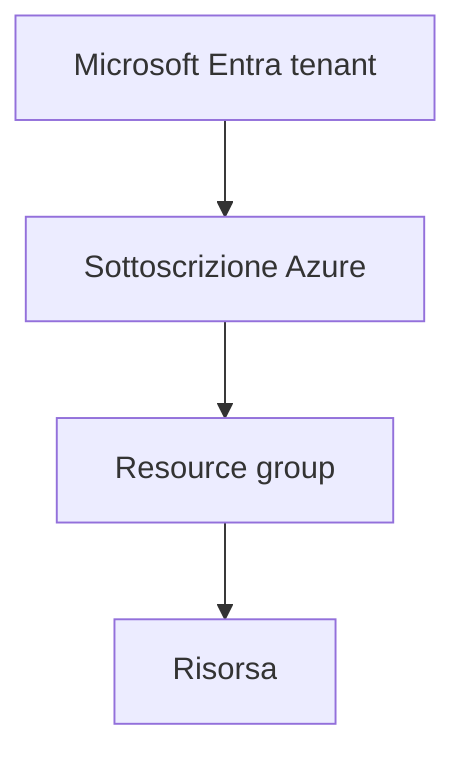

# Concetti — Dal modello cloud alla struttura di Microsoft Azure

## 1. Perché partire dai modelli

Un servizio cloud non è definito soltanto dal fatto che venga raggiunto tramite Internet. Il cloud combina risorse condivise, provisioning rapido, misurazione dell'uso, automazione e possibilità di aumentare o ridurre la capacità senza acquistare ogni volta nuovo hardware.

Prima di creare una risorsa dobbiamo quindi rispondere a tre domande:

- dove viene eseguito il carico di lavoro;
- quale parte della piattaforma gestiamo direttamente;
- quale livello di isolamento, controllo e costo richiede lo scenario.

Queste domande ricompariranno quando confronteremo una macchina virtuale con App Service, un'applicazione locale con Container Apps e una procedura manuale con Infrastructure as Code.

## 2. Cloud pubblico, privato e ibrido

Nel cloud pubblico le risorse vengono erogate da un provider attraverso una piattaforma condivisa. Il cliente mantiene isolamento logico, identità, autorizzazioni e configurazioni, ma non possiede l'infrastruttura fisica del provider.

Nel cloud privato l'infrastruttura è dedicata a una singola organizzazione. Può trovarsi nel datacenter aziendale oppure essere ospitata da un fornitore. Offre maggiore controllo diretto, ma richiede capacità operative, investimenti e manutenzione.

Nel cloud ibrido componenti locali e cloud pubblico cooperano. Un'applicazione può, per esempio, conservare alcuni dati nel datacenter aziendale e utilizzare Azure per un frontend, un sistema di backup o capacità temporanea.

| Modello | Punto di forza | Impegno del cliente | Scenario essenziale |
|---|---|---|---|
| Pubblico | rapidità e disponibilità di servizi gestiti | configurazione, identità, dati, costi e governance | nuova applicazione distribuita in Azure |
| Privato | controllo e isolamento dedicato | infrastruttura, aggiornamenti, capacità e continuità | sistema soggetto a vincoli interni specifici |
| Ibrido | integrazione progressiva | coordinamento di ambienti, rete, identità e sicurezza | estensione in Azure di un sistema esistente |

Il modello ibrido non è automaticamente migliore. Introduce connessioni, dipendenze e responsabilità su entrambi gli ambienti. La scelta dipende dai requisiti, non da una preferenza astratta.

## 3. IaaS, PaaS e SaaS

IaaS, PaaS e SaaS descrivono quanto della pila tecnologica viene gestito dal provider.

### Infrastructure as a Service

In IaaS il provider mette a disposizione infrastruttura virtualizzata. Una macchina virtuale Azure è l'esempio più immediato: Microsoft gestisce datacenter, hardware e piattaforma di virtualizzazione; il cliente gestisce sistema operativo guest, aggiornamenti, configurazione, software, identità e dati.

IaaS è adatta quando serve un controllo elevato sul sistema operativo o quando un'applicazione non può essere trasferita facilmente su un servizio gestito. Questo controllo comporta più lavoro operativo.

### Platform as a Service

In PaaS il provider gestisce anche sistema operativo, runtime e parte della piattaforma applicativa. Con Azure App Service il cliente distribuisce codice e configurazione senza amministrare direttamente il sistema operativo sottostante.

Rimangono comunque responsabilità del cliente:

- codice e dipendenze applicative;
- configurazione del servizio;
- identità e autorizzazioni;
- protezione e classificazione dei dati;
- scelta del piano e controllo dei costi;
- verifica del comportamento dell'applicazione.

### Software as a Service

In SaaS il provider eroga un'applicazione completa. Il cliente configura utenti, permessi, dati e opzioni del prodotto, ma non distribuisce normalmente il runtime o il sistema operativo.

Microsoft 365 è un esempio di SaaS. L'organizzazione non amministra i server che eseguono il servizio, ma deve ancora proteggere gli account, definire l'accesso ai dati e governare l'utilizzo.

## 4. Responsabilità condivisa

Spostare un carico nel cloud non trasferisce ogni responsabilità al provider. Microsoft protegge l'infrastruttura fisica e i componenti gestiti dal servizio; il cliente rimane sempre responsabile almeno di dati, identità, autorizzazioni, configurazioni e dispositivi con cui accede.

| Livello | IaaS | PaaS | SaaS |
|---|---|---|---|
| Datacenter e hardware | Microsoft | Microsoft | Microsoft |
| Virtualizzazione | Microsoft | Microsoft | Microsoft |
| Sistema operativo | Cliente | Microsoft | Microsoft |
| Runtime e middleware | Cliente | Microsoft | Microsoft |
| Applicazione | Cliente | Cliente/provider secondo il servizio | Microsoft/provider |
| Dati, identità e accessi | Cliente | Cliente | Cliente |

La tabella è un modello di ragionamento, non sostituisce la documentazione del singolo servizio. Un servizio PaaS può offrire controlli differenti da un altro. Prima di un deployment reale bisogna verificare proprietà, limiti e responsabilità specifiche.

La [documentazione Microsoft sulla responsabilità condivisa](https://learn.microsoft.com/azure/security/fundamentals/shared-responsibility) chiarisce come la divisione cambi tra IaaS, PaaS e SaaS.

## 5. Dalla directory alla risorsa

Le risorse Azure sono organizzate in livelli. Comprendere la gerarchia evita errori di contesto, autorizzazione e cleanup.



Il tenant Microsoft Entra contiene identità e oggetti della directory. Una sottoscrizione è un confine di fatturazione, quota, accesso e organizzazione delle risorse. Il resource group è un contenitore logico all'interno della sottoscrizione. Ogni risorsa Resource Manager appartiene a una sola sottoscrizione e a un solo resource group.

Un'organizzazione può avere più sottoscrizioni nello stesso tenant. Può inoltre utilizzare management group sopra le sottoscrizioni per applicare governance su larga scala. Nel laboratorio individuale useremo una sottoscrizione e non creeremo management group.

### La sottoscrizione non è il resource group

La sottoscrizione comprende resource group, quote, provider registrati e informazioni di fatturazione. Il resource group raggruppa risorse che condividono normalmente ciclo di vita, scopo o responsabilità.

Eliminare un resource group elimina anche le risorse che contiene. Per questo nel corso ogni laboratorio userà un resource group dedicato: il cleanup diventa controllabile e non coinvolge risorse estranee.

### Il resource ID

Azure Resource Manager identifica ogni risorsa con un percorso simile a:

```text
/subscriptions/<SUBSCRIPTION_ID>/resourceGroups/<RESOURCE_GROUP>/providers/<NAMESPACE>/<TYPE>/<NAME>
```

Il resource ID contiene contesto e gerarchia. Non è una password, ma può rivelare nomi interni e l'identificativo della sottoscrizione; nel repository pubblico ne conserveremo soltanto una forma anonimizzata.

## 6. Region e availability zone

Una region Azure è un'area geografica che contiene uno o più datacenter collegati. Quando creiamo una risorsa scegliamo spesso una region in base a:

- disponibilità del servizio;
- requisiti di residenza e protezione dei dati;
- latenza verso utenti e sistemi;
- costo del servizio nella località;
- capacità e quote disponibili;
- strategia di continuità operativa.

Una availability zone è un gruppo separato di datacenter all'interno di una region, con alimentazione, raffreddamento e rete indipendenti. Le zone riducono il rischio che un singolo guasto infrastrutturale interrompa tutte le istanze distribuite correttamente.

Non tutte le region e non tutti i servizi supportano le zone nello stesso modo. Alcuni servizi sono zonali, altri zone-redundant, altri ancora non espongono una scelta di zona. La [panoramica Microsoft sulle availability zone](https://learn.microsoft.com/azure/reliability/availability-zones-overview) deve essere consultata prima di progettare alta disponibilità reale.

Nel laboratorio non distribuiremo risorse ridondate tra zone: introdurrebbe costi e complessità non necessari. Impareremo invece a distinguere la località del resource group da quella delle risorse.

### Località del resource group

Anche il resource group possiede una località. Essa indica dove Azure conserva i metadati del contenitore, non obbliga tutte le risorse al suo interno a trovarsi nella stessa region. Nel corso useremo comunque la stessa località per mantenere leggibile il laboratorio.

## 7. Compute, rete e storage

Le famiglie di servizi non sono compartimenti isolati. Un'applicazione richiede normalmente capacità di calcolo, connettività e persistenza.

### Compute

Il compute esegue codice e processi. In Azure incontreremo:

- Virtual Machines per il controllo del sistema operativo;
- App Service per applicazioni web gestite;
- Container Apps per applicazioni containerizzate senza gestione diretta di un cluster;
- funzioni serverless per esecuzioni attivate da eventi.

In questa unità li distinguiamo. Le VM e App Service verranno amministrati nell'UD06; Container Apps verrà utilizzato dopo Docker e ACR.

### Rete

La rete determina come risorse e utenti comunicano. Gli elementi iniziali sono:

- Virtual Network come spazio di rete logico;
- subnet per suddividere l'indirizzamento;
- indirizzi pubblici e privati;
- Network Security Group per controllare il traffico;
- DNS per tradurre nomi in indirizzi.

Nel laboratorio creeremo una VNet e una subnet soltanto per osservare struttura e proprietà. Indirizzamento, NSG e troubleshooting verranno approfonditi nell'UD05.

### Storage

Lo storage conserva dati persistenti. Uno storage account è il contenitore amministrativo attraverso il quale Azure espone servizi come Blob, Files, Queue e Table.

In questa unità creeremo uno storage account vuoto con configurazioni di sicurezza essenziali. Tipi di dato, ridondanza, livelli di accesso, SAS e autorizzazioni verranno affrontati nell'UD04.

## 8. Azure Portal, Cloud Shell e Azure CLI

Azure Portal è l'interfaccia web. È utile per scoprire servizi, leggere proprietà e osservare relazioni. Un portale non rende però automaticamente ripetibile una procedura: due persone possono selezionare opzioni differenti senza accorgersene.

Azure CLI espone comandi riproducibili. Un comando può essere conservato, confrontato, inserito in uno script e successivamente trasformato in una pipeline. Per questo ogni azione importante eseguita nel portale verrà verificata anche tramite CLI quando possibile.

Azure Cloud Shell è un terminale autenticato accessibile dal browser. Offre Bash o PowerShell e include strumenti Azure preconfigurati. Viene eseguito su un host temporaneo; una sessione inattiva termina e la persistenza dei file dipende dalla configurazione dello storage. La [panoramica ufficiale di Cloud Shell](https://learn.microsoft.com/azure/cloud-shell/overview) descrive queste caratteristiche.

Nel corso useremo due contesti CLI:

| Contesto | Vantaggio | Controllo necessario |
|---|---|---|
| Azure CLI in WSL | file nel repository locale e continuità con Docker/Terraform | `az version`, login e sottoscrizione attiva |
| Azure Cloud Shell | nessuna installazione locale e autenticazione integrata | shell selezionata, sottoscrizione e persistenza dei file |

Cloud Shell non sostituisce WSL. È un ambiente remoto temporaneo utile per amministrare Azure; WSL è il nostro ambiente locale di lavoro e contiene il repository Git.

## 9. Contesto prima del comando

Un comando corretto eseguito nella sottoscrizione sbagliata produce una risorsa reale nel posto sbagliato. Prima di creare risorse bisogna controllare:

```bash
az account show --output table
```

Se l'account possiede più sottoscrizioni:

```bash
az account list --output table
az account set --subscription "<NOME_O_ID_SOTTOSCRIZIONE>"
az account show --output table
```

Il secondo `az account show` non è una ripetizione inutile: dimostra che il contesto è cambiato. Nel repository scriveremo il nome descrittivo della sottoscrizione soltanto se non contiene informazioni riservate; non pubblicheremo l'ID.

Le località disponibili nella sottoscrizione possono essere interrogate con:

```bash
az account list-locations --output table
```

La [guida Microsoft ai resource group con Azure CLI](https://learn.microsoft.com/cli/azure/manage-azure-groups-azure-cli?view=azure-cli-latest) utilizza lo stesso comando prima della creazione.

## 10. Naming e tagging

Un nome tecnico dovrebbe rendere riconoscibili almeno tipo, scopo e ambiente senza includere dati personali o segreti. Non tutti i servizi applicano le stesse regole: uno storage account, per esempio, richiede un nome globale composto soltanto da lettere minuscole e numeri.

Nel laboratorio useremo forme come:

```text
rg-cea-ud02-<suffisso>
vnet-cea-ud02
stcea<suffisso>
```

Il suffisso evita collisioni sui nomi globali. Non useremo nome e cognome.

I tag sono coppie chiave-valore associate a resource group e risorse. Possono descrivere corso, unità, ambiente, scopo e data prevista di eliminazione:

```text
course=cloud-engineer-academy
unit=UD02
environment=lab
deleteAfter=AAAA-MM-GG
```

I tag facilitano inventario, governance e analisi dei costi. Non sono un meccanismo di autorizzazione e non devono contenere dati sensibili. I tag applicati al resource group non vengono automaticamente ereditati da tutte le risorse: il laboratorio li applicherà esplicitamente. La [documentazione Microsoft sui tag](https://learn.microsoft.com/azure/azure-resource-manager/management/tag-resources) descrive utilizzo e limitazioni.

## 11. Costi e cleanup

Un resource group e una rete virtuale non hanno normalmente un costo diretto, ma le risorse collegate possono generarlo. Uno storage account vuoto ha un impatto minimo, ma utilizzo, transazioni, capacità e trasferimenti possono produrre addebiti.

Non basta eseguire il comando di eliminazione. Il cleanup è completo quando Azure conferma che il resource group non esiste più. Nel lavoro reale questa verifica evita che dischi, indirizzi pubblici, registry o ambienti applicativi restino attivi dopo una prova.

La nostra sequenza sarà:

```text
inventario → creazione → verifica → evidenza → eliminazione → verifica dell'eliminazione
```

⏱

## 12. Domande di controllo prima dell'attività pratica

Inserisci le risposte motivate in `consegne/UD02/00_DOMANDE_CONCETTI.md`.

1. Perché una macchina virtuale lascia al cliente più responsabilità operative rispetto ad App Service?
2. Qual è la differenza tra tenant, sottoscrizione e resource group?
3. Perché la località del resource group non obbliga tutte le risorse a usare la stessa region?
4. Quale differenza esiste tra una region e un'availability zone?
5. Perché `az account show` deve precedere la creazione di una risorsa?
6. Perché i tag non devono essere usati come meccanismo di sicurezza?
7. Quale vantaggio offre Azure CLI rispetto alla sola operazione nel portale?
8. Perché l'esecuzione del comando di eliminazione non dimostra da sola che il cleanup sia concluso?

⏱
